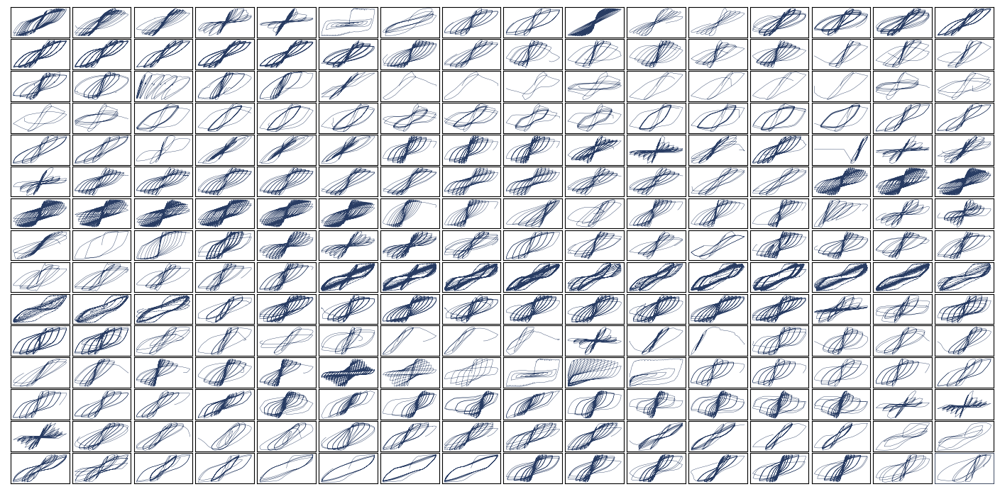
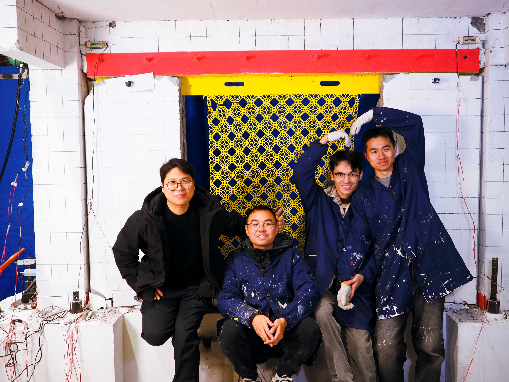

# Hi 🐼 Welcome to Ashen's Github Homepage!

  

  

&emsp;&emsp;     

### 🧾经常访问的链接(Frequently visited links)    
<!-- 经常访问的图标 -->

 
<!-- visitor statistics logo 访客数统计徽标 -->

  

 

  
# 🌟🌟🌟🌟🌟🌟🌟🌟我的仓库系列🌟🌟🌟🌟🌟🌟🌟🌟
  

 

### 🏛OpenSeesPy教学(My tutorial on OpenSees)        
&ensp;&ensp;&ensp;&ensp;&ensp;&ensp;&ensp;&ensp;[**|————基础案例及常见问题(Basic cases and frequently asked questions)**](https://github.com/AshenOneme/OpenSeespy-common-problems-and-cases)      
&ensp;&ensp;&ensp;&ensp;&ensp;&ensp;&ensp;&ensp;[**|————自复位节点分析(Analysis of self-centering joints)**](https://github.com/AshenOneme/OpenSees-Self-centering-beam-to-column-connections)     
&ensp;&ensp;&ensp;&ensp;&ensp;&ensp;&ensp;&ensp;[**|————自复位框架结构易损性分析(Seismic vulnerability analysis of self-centering frame structure)**](https://github.com/AshenOneme/OpenSees-Self-centering-frame-IDA)     
&ensp;&ensp;&ensp;&ensp;&ensp;&ensp;&ensp;&ensp;[**|————遗传算法优化(Structural vibration optimization of genetic algorithm)**](https://github.com/AshenOneme/Structural-optimization-based-on-genetic-algorithm)     
&ensp;&ensp;&ensp;&ensp;&ensp;&ensp;&ensp;&ensp;[**|————拓扑优化(Topology optimization based on OpenSeesPy)**](https://github.com/AshenOneme/Topology-optimization)     
### 📡机器学习(Machine learning)        

&ensp;&ensp;&ensp;&ensp;&ensp;&ensp;&ensp;&ensp;[**|————基于扩散模型的柱截面逆向设计(Inverse design of column cross-sections based on diffusion models)**](https://github.com/AshenOneme/CCSC-Prediction-Inverse-Design)  
&ensp;&ensp;&ensp;&ensp;&ensp;&ensp;&ensp;&ensp;[**|————结构破坏预测(Structural damage prediction)**](https://github.com/AshenOneme/Machine-learning-for-structural-damage-prediction)     
&ensp;&ensp;&ensp;&ensp;&ensp;&ensp;&ensp;&ensp;[**|————机器视觉框架(Machine vision framework——based on Raspberry Pi)**](https://github.com/AshenOneme/Yolov5-Lite-Raspberry-Pi)    
&ensp;&ensp;&ensp;&ensp;&ensp;&ensp;&ensp;&ensp;[**|————欠耦合系统平衡(Study on the equilibrium of undercoupled systems——based on Raspberry Pi)**](https://github.com/AshenOneme/Balance-car)    
&ensp;&ensp;&ensp;&ensp;&ensp;&ensp;&ensp;&ensp;[**|————安全帽识别(Safety helmet identification——based on Yolov5)**](https://github.com/AshenOneme/Yolov5-Safety-helmet)  

### 🚀自编程序(Self-developed program) 
&ensp;&ensp;&ensp;&ensp;&ensp;&ensp;&ensp;&ensp;[**|————滞回曲线处理程序(Hysteresis curves processing program)**](https://github.com/AshenOneme/Hysteresis-curve-processing-program)     
&ensp;&ensp;&ensp;&ensp;&ensp;&ensp;&ensp;&ensp;[**|————OpenSeesPy截面生成工具(Abaqus To OpenSeesPy Section)**](https://github.com/AshenOneme/Abaqus-To-OpenSeesPy-Section)      
&ensp;&ensp;&ensp;&ensp;&ensp;&ensp;&ensp;&ensp;[**|————论文配色优化工具(Paper color optimization tool)**](https://github.com/AshenOneme/Color_select)        

### 📚我的论文(My research paper)        
&ensp;&ensp;&ensp;&ensp;&ensp;&ensp;&ensp;&ensp;[**|———砌体结构加固(Strengthening of masonry structures)**](https://github.com/AshenOneme/Research-papers/tree/main/Experimental%20and%20numerical%20investigation%20on%20the%20seismic%20performance%20of%20masonry%20walls%20reinforced%20by%20PC%20panels)         
&ensp;&ensp;&ensp;&ensp;&ensp;&ensp;&ensp;&ensp;[**|———自复位混合节点的低周往复试验(Low cycle reciprocating test of self-centering hybrid connections)**](https://github.com/AshenOneme/Research-papers/tree/main/Experimental%20and%20numerical%20investigations%20on%20novel%20post-tensioned%20precast%20beam-to-column%20energy-dissipating%20connections)        
&ensp;&ensp;&ensp;&ensp;&ensp;&ensp;&ensp;&ensp;[**|———震损混合节点的加固试验(Reinforcement test of earthquake-damaged hybrid connections)**](https://github.com/AshenOneme/Research-papers/tree/main/Seismic%20behavior%20of%20earthquake-damaged%20hybrid%20connections%20reinforced%20with%20replaceable%20energy-dissipating%20elements)       
&ensp;&ensp;&ensp;&ensp;&ensp;&ensp;&ensp;&ensp;[**|———基于机器学习方法的结构地震响应预测(Structural seismic response prediction based on ML method)**](https://github.com/AshenOneme/Research-papers/tree/main/Seismic%20response%20prediction%20of%20a%20damped%20structure%20based%20on%20data-driven%20methods)    
&ensp;&ensp;&ensp;&ensp;&ensp;&ensp;&ensp;&ensp;[**|———大跨隔震结构振动台试验(Shaking table test of long span isolated structure)**](https://github.com/AshenOneme/Research-papers/tree/main/Shaking%20Table%20Tests%20and%20Numerical%20Analysis%20of%20the%20Interaction%20of%20a%20Base-isolated%20Steel%20Frame's%20Responses%20with%20a%20Long-span%20Roof)    
&ensp;&ensp;&ensp;&ensp;&ensp;&ensp;&ensp;&ensp;[**|———自复位框架结构动力特性演化(The evolution of dynamic characteristics of SCCF structures)**](https://github.com/AshenOneme/Research-papers/tree/main/Study%20on%20the%20evolution%20of%20dynamic%20characteristics%20and%20seismic%20damage%20of%20a%20self-centering%20concrete%20structure%20based%20on%20data-driven%20methods)     
&ensp;&ensp;&ensp;&ensp;&ensp;&ensp;&ensp;&ensp;[**|———砌体填充墙损伤反演(Inversion of seismic damage to masonry infill walls based on DDPM)**](https://github.com/AshenOneme/Research-papers/tree/main/Rapid%20Inversion%20of%20Seismic%20Damage%20to%20Infill%20Walls%20Based%20on%20Diffusion%20Models)                             
&ensp;&ensp;&ensp;&ensp;&ensp;&ensp;&ensp;&ensp;[**|———基于扩散模型的耗能墙逆向设计(Inverse design of EDSWs based on diffusiuon models)**](https://github.com/AshenOneme/Research-papers/tree/main/Inverse%20design%20of%20energy-dissipating%20steel%20plate%20walls%20based%20on%20self-supervised%20diffusion%20models)          
&ensp;&ensp;&ensp;&ensp;&ensp;&ensp;&ensp;&ensp;[**|———多尺度耗能微结构逆向设计(Inverse design of multiscale microstructures)**](https://github.com/AshenOneme/Research-papers/tree/main/MultiDampGen%20A%20Self-constraint%20Latent%20Diffusion%20Framework%20for%20Multiscale%20Energy-dissipating%20Microstructure%20Generation)     
&ensp;&ensp;&ensp;&ensp;&ensp;&ensp;&ensp;&ensp;[**|———耗能微结构多目标逆向设计(Inverse design of damping microstructures with multiaxial targets)**](https://github.com/AshenOneme/Research-papers/tree/main/Latent%20diffusion%E2%80%93driven%20inverse%20design%20of%20damping%20microstructures)

<!-- Self introduction 自我介绍 -->
#  🙋 Hello
>### &nbsp;&nbsp;&nbsp;&nbsp;*I come from Nanjing, Jiangsu province in China and I am currently studying civil engineering as my major at NJTU. Additionally, I have a strong interest in deep learning, microstructures and novel resilient structures!*

>### &nbsp;&nbsp;&nbsp;&nbsp;*My ORCID:*
<a
id="cy-effective-orcid-url"
class="underline"
 href="https://orcid.org/0009-0004-4454-8112"
 target="orcid.widget"
 rel="me noopener noreferrer"
 style="vertical-align: top">
 
  https://orcid.org/0009-0004-4454-8112
</a>

  

 
  
  

 
  

 
<!-- visitor statistics logo 访客数统计徽标 -->
</a>

 
